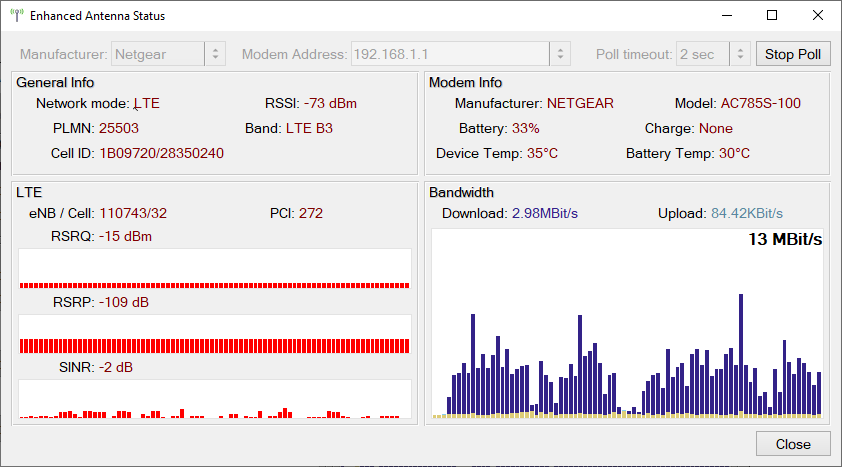

# Enhanced Entenna Status

## Description

UI util that checks modem status.

Supported manufacturers:
* Netgear

Tested on:
* Netgear: MR2100, AC785S

## TODO

- UI enhancements
  - [ ] Hide unused info (e.g. 3G in LTE mode)
  - [ ] Adjust poll timeout (longer timeouts to reduce load on the modem)
- [ ] Auto-detect modem manufacturer (why? users usually know the manufacturer)
- [ ] Create pre-filled list of host addresses: scan networks and get gateways
- [ ] Additional info for Netgear from Telnet (channels and band widths) (need to resolve long timeout issues)
- [ ] Huawei support
  - [ ] Set LTE band list
- [ ] Download/upload bar plot

## Links

* JS plugins for Web dashboards: https://github.com/Postrediori/HuaweiMobileDashboard
