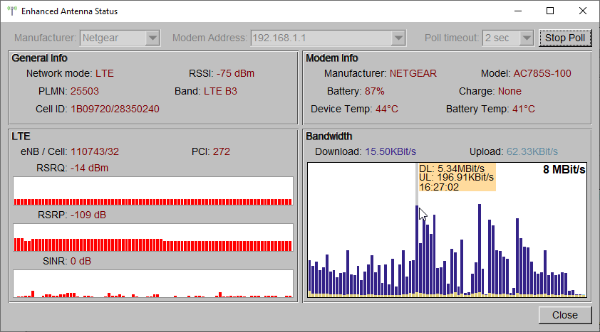
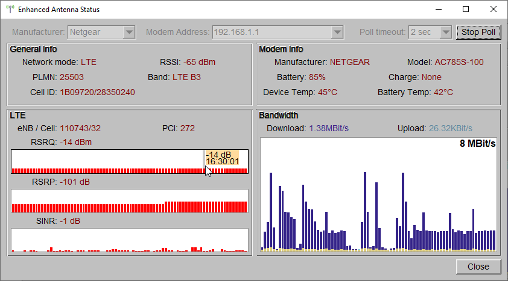
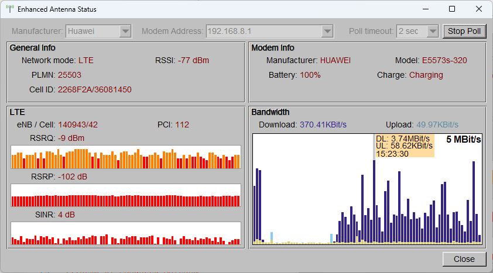

# Enhanced Entenna Status

## Description

UI util that checks modem status and shows history bar plot of signal strength parameters. This data may be helpful during precise antenna pointing or positioning the modem when using internal antenna only.

Checking history of download/upload bandwidth and signal params:

Information about Huawei modem:

Supported manufacturers:
* Netgear
* Huawei

Tested on:
* Netgear: MR2100, AC785S
* Huawei: E8372h-608, E5573s-320

## Video demo

## TODO

- UI enhancements
  - [x] Hide unused info (e.g. 3G in LTE mode)
  - [x] Adjust poll timeout (longer timeouts to reduce load on the modem)
- [ ] Create pre-filled list of host addresses: scan networks and get gateways
- [ ] Additional info for Netgear from Telnet (channels and band widths) (need to resolve long timeout issues)
- [x] Download/upload bar plot

## Links

* JS plugins for Web dashboards: https://github.com/Postrediori/HuaweiMobileDashboard
